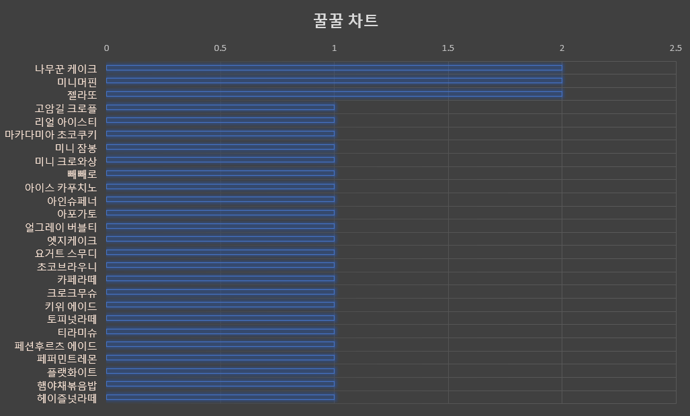

# 주문기록
| 날짜       | 먹은 메뉴                                                    | 수량                   |
| ---------- | ------------------------------------------------------------ | ---------------------- |
| JUL 4, 20  | 아인슈페너 초코브라우니                                 | 1 1               |
| JUL 5, 20  | 헤이즐넛라떼 아포가토 티라미슈 페퍼민트레몬   | 1 1 1 1 |
| OCT 27, 20 | 패션후르츠 에이드 with 할로윈샷 크로크 무슈             | 1 1               |
| DEC 6, 20  | 햄야채볶음밥 카페라떼 빼빼로 미니머핀         | 1 1 1 1 |
| JAN 6, 21  | 플랫화이트 나무꾼 케이크(매장1, 포장1) 미니머핀 엣지케이크 | 1 2 1 1 |
| MAR 8, 21  | 고암길 크로플(레몬치즈) 얼그레이 버블티                 | 1 1               |
| MAR 13, 21 | 리얼 아이스티 (블루베리) with 블랙펄                         | 1                      |
| MAR 17, 21 | 키위 에이드 젤라또(요거트)                              | 1 1               |
| APR 2, 21  | 아이스 카푸치노 젤라또(다크초코)                        | 1 1               |
| APR 12, 21 | 요거트 스무디 (블루베리) 미니 크로와상x3                | 1 1               |
| APR 26, 21 | 토피넛라떼 미니 잠봉 마카다미아 초코쿠키           | 1 1 1        |
| MAY 2, 21  | 자몽티 블루베리 라떼                                    | 1 1               |

## 메뉴별 꿀꿀그래프

- 정렬: 많이먹은순

